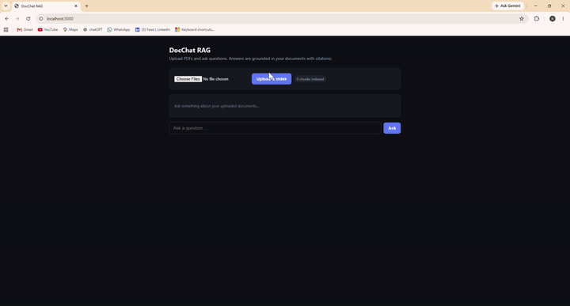
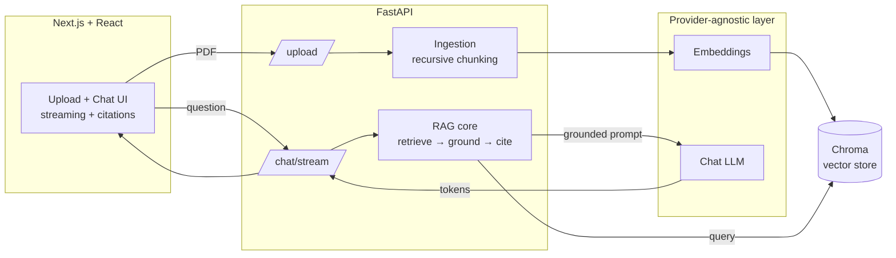

# DocChat RAG — Grounded Document Q&A with Citations

A production-shaped Retrieval-Augmented Generation (RAG) application: upload PDFs,
ask questions, and get answers that are **grounded in your documents**, **cited
back to the exact source and page**, and **streamed token-by-token**. Ships with
a **provider-agnostic LLM layer**, a **hallucination guardrail**, and an
**evaluation harness** that measures retrieval and answer quality with numbers.

> Built to demonstrate full-stack AI engineering: a Python/FastAPI AI backend
> behind a React/Next.js frontend, with the design tradeoffs documented rather
> than hidden.

---

## Demo



*Upload a PDF → ask questions → answers stream in with inline citations → out-of-scope
questions are refused instead of answered.* &nbsp; [▶ Watch full-quality video](docs/demo.mp4)

---

## Architecture



**Flow:** PDFs are chunked → embedded → stored in Chroma. A question is embedded,
the nearest chunks are retrieved, and — *only if a chunk clears the relevance
threshold* — a grounded prompt with numbered context is sent to the LLM, which
answers with inline `[1]`/`[2]` citations streamed back to the UI.

---

## Why this isn't a tutorial clone

These are the parts most demos skip — and the parts interviewers probe:

| Decision | What I did | Why |
|---|---|---|
| **Provider abstraction** | LLM + embeddings sit behind ABCs (`app/llm/base.py`); **OpenAI and Google Gemini** both implemented, selectable via one env var. | Swap providers by adding one file — no change to RAG, API, or tests. Gemini's free tier means it runs at $0. |
| **Multimodal ingestion** | Pages rendered with PyMuPDF and read by a vision model into Markdown — tables, charts, figures, and scanned text. | Plain text extraction misses everything that isn't a text layer. Vision captures the whole page. |
| **Grounding guardrail** | If the best chunk's distance exceeds a threshold, the system refuses instead of answering. | Stops the classic RAG failure: answering from the model's memory when the docs don't contain the answer. |
| **Citations** | Numbered context; the model must cite; the API returns source + page + snippet. | Every claim is auditable — the difference between a toy and something trustworthy. |
| **Evaluation** | Harness scores retrieval hit-rate, answer correctness, and faithfulness (LLM-as-judge), incl. negative tests. | You can't improve what you don't measure — the strongest seniority signal in the repo. |
| **Security** | `pip-audit` (0 CVEs), upload size/page caps, configurable CORS, secrets kept out of git. | Shows production awareness. See [SECURITY.md](SECURITY.md). |

---

## Tech stack

- **Backend:** Python, FastAPI, Pydantic, pypdf, PyMuPDF, ChromaDB
- **LLM/Embeddings:** OpenAI (`gpt-4o-mini`) or Google Gemini (`gemini-2.5-flash`, free tier) behind a swappable interface
- **Multimodal:** vision model reads tables, charts, figures, and scanned pages (PyMuPDF render → vision transcription)
- **Frontend:** Next.js (App Router), React, TypeScript
- **Vector store:** Chroma (persistent, cosine space)
- **Security:** dependency audit (pip-audit, 0 CVEs), upload size/page limits, configurable CORS — see [SECURITY.md](SECURITY.md)

---

## Quickstart

### Easiest path (Windows, one click)

Three helper scripts in the project root automate the whole setup. Run them in order:

| Script | What it does |
|---|---|
| **`1-setup.bat`** | Checks Python/Node, creates the backend virtual environment, installs all dependencies, and creates your `.env` files. Run once. |
| **`2-start-backend.bat`** | Starts the FastAPI backend on `http://localhost:8000`. Leave the window open. |
| **`3-start-frontend.bat`** | Starts the Next.js frontend on `http://localhost:3000`. Leave the window open. |

After `1-setup.bat`, open `backend\.env`, paste your free **`GEMINI_API_KEY`** (get one at
[aistudio.google.com/apikey](https://aistudio.google.com/apikey)) into the `GEMINI_API_KEY=` line,
save, then run scripts 2 and 3 and open **http://localhost:3000**.

> The app defaults to **Google Gemini's free tier**, so it runs at $0. To use OpenAI instead,
> set `LLM_PROVIDER=openai` and `EMBEDDING_PROVIDER=openai` in `.env` and add `OPENAI_API_KEY`.

### Manual path (any OS)

#### 1. Backend
```bash
cd backend
python -m venv .venv && source .venv/bin/activate   # Windows: .venv\Scripts\activate
pip install -r requirements.txt
cp .env.example .env        # defaults to Gemini (free) — add your GEMINI_API_KEY
uvicorn app.main:app --reload --port 8000
```

### 2. Frontend
```bash
cd frontend
npm install
cp .env.local.example .env.local
npm run dev                 # http://localhost:3000
```

#### 3. Use it
Upload a PDF in the UI, then ask questions. Or via API:
```bash
curl -F "files=@yourdoc.pdf" http://localhost:8000/upload
curl -X POST http://localhost:8000/chat -H "Content-Type: application/json" \
     -d '{"question":"What is the refund window?"}'
```

---

## Try it with a sample document

No PDF handy? Use the classic **"Attention Is All You Need"** paper (the Transformer paper) —
it's public, text-based, and fact-dense, which makes citations and the guardrail easy to show:

- Download: **https://arxiv.org/pdf/1706.03762**

Upload it, then ask these questions. The first four are answerable from the paper (you'll get
cited answers); the last one is **not** in the paper, so the app should refuse instead of
guessing — that's the grounding guardrail in action:

| Question | Expected |
|---|---|
| What is the name of the architecture proposed in this paper? | The Transformer |
| How many layers are in the encoder and decoder stacks? | 6 each (N = 6) |
| How many attention heads does the model use? | 8 |
| What BLEU score did the model achieve on English-to-German translation? | 28.4 |
| *What is the capital of Canada?* | **Refuses** — not covered by the document |


---

## Configuration & tuning

All knobs live in `backend/.env` (typed in `app/config.py`): chunk size/overlap,
`TOP_K`, and `RELEVANCE_DISTANCE_THRESHOLD` (the guardrail sensitivity). Use the
eval harness to sweep these and pick values that maximize retrieval hit-rate
without letting the guardrail leak.

---

## Limitations & what I'd do next

Being explicit about tradeoffs is part of the point:

- **Multimodal ingestion** — when `MULTIMODAL` is on, pages are rendered and read by a vision model, so tables, charts, figures, and scanned PDFs are captured (one vision call per page; toggle off for fast text-only mode).
- **No auth/multi-tenant** — fine for a single-user demo, not for prod. Would add per-user namespaces and authentication (see [SECURITY.md](SECURITY.md)).
- **LLM-as-judge is approximate** — good for relative comparison, not ground truth; a human-labeled set would be stronger.
- **No reranking** — adding a cross-encoder reranker after vector retrieval would likely lift precision.
- **Agentic upgrade** — let the model decide *when* to retrieve and add a second tool (web search) to make this an agentic RAG system.

---

## Project layout

```
backend/
  app/
    config.py            # typed settings from .env
    main.py              # FastAPI: /upload /chat /chat/stream /sources /health
    ingestion.py         # PDF load + recursive chunking
    vectorstore.py       # Chroma wrapper (we own the embeddings)
    rag.py               # retrieve → ground → cite → (stream)
    llm/
      base.py            # provider-agnostic ABCs
      openai_provider.py # OpenAI implementation
      factory.py         # config → concrete provider
  eval/
    run_eval.py          # retrieval / correctness / faithfulness metrics
    questions.example.json
frontend/
  app/
    page.tsx             # upload + streaming chat + citations
    layout.tsx, globals.css
Dockerfile               # single-container build (UI + API, one URL)
render.yaml              # one-click Render Blueprint
```

---

## Deployment

The app ships as a **single container** — the Next.js UI is built to static files
and served by FastAPI, so the whole thing runs as one service on one URL (ideal
for a custom subdomain). Vision is **off by default** in production to protect
free-tier quota; users opt in per upload via the "Read tables & images" toggle.
A per-IP rate limit guards the public endpoints.

**Deploy to Render (free):**

1. Push the repo to GitHub.
2. Render → **New + → Blueprint** → select the repo (it reads `render.yaml`).
3. Set **`GEMINI_API_KEY`** in the dashboard (and optionally `NEXT_PUBLIC_GA_ID`
   as a build-time var for analytics). Deploy.
4. You get a free URL like `docchat.onrender.com`.

**Custom subdomain (Cloudflare):** in Render add `docchat.yourdomain.com` under
Custom Domains, then add a matching `CNAME` in Cloudflare DNS pointing to the
Render target. HTTPS is automatic.

> Note: the free tier sleeps when idle and uses an ephemeral disk, so the Chroma
> index resets on restart — fine for a demo. Add a persistent disk for durability.

## Analytics

Google Analytics 4 is built in. Set **`NEXT_PUBLIC_GA_ID`** (`G-XXXXXXXX`) to
enable it; it stays off when unset (local dev). Beyond page views, the app emits
custom events — `pdf_uploaded`, `question_asked`, `pdf_upload_failed` — so you can
see real product usage.

---
