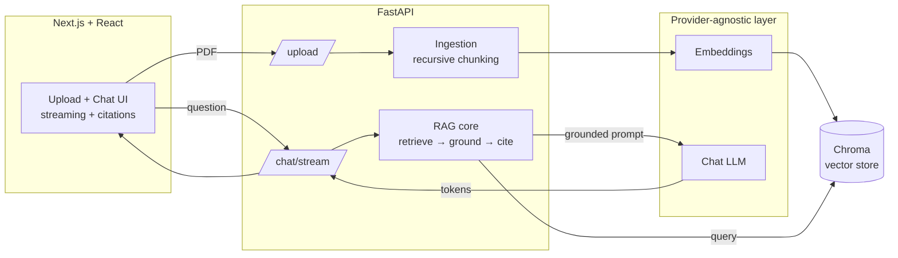

# DocChat RAG — Grounded Document Q&A with Citations

A production-shaped Retrieval-Augmented Generation (RAG) application: upload PDFs,
ask questions, and get answers that are **grounded in your documents**, **cited
back to the exact source and page**, and **streamed token-by-token**. Ships with
a **provider-agnostic LLM layer**, a **hallucination guardrail**, and an
**evaluation harness** that measures retrieval and answer quality with numbers.

> Built to demonstrate full-stack AI engineering: a Python/FastAPI AI backend
> behind a React/Next.js frontend, with the design tradeoffs documented rather
> than hidden.

---

## Demo

> Record a 30–60s GIF/Loom of: upload a PDF → ask a question → watch the answer
> stream with citations → ask an out-of-scope question and watch it refuse.
> Embed it here. (A demo GIF does ~90% of what a live URL does for a reviewer.)

``

---

## Architecture



**Flow:** PDFs are chunked → embedded → stored in Chroma. A question is embedded,
the nearest chunks are retrieved, and — *only if a chunk clears the relevance
threshold* — a grounded prompt with numbered context is sent to the LLM, which
answers with inline `[1]`/`[2]` citations streamed back to the UI.

---

## Why this isn't a tutorial clone

These are the parts most demos skip — and the parts interviewers probe:

| Decision | What I did | Why |
|---|---|---|
| **Provider abstraction** | LLM + embeddings sit behind ABCs (`app/llm/base.py`); OpenAI is one implementation wired in `factory.py`. | Swap to Anthropic / Ollama / local by adding one file — no change to RAG, API, or tests. Portability is an engineering signal. |
| **Chunking** | Recursive splitter that breaks on paragraph → line → sentence → word before hard-cutting. | Fixed-size slicing splits mid-sentence and pollutes retrieval. Coherent chunks retrieve better. |
| **Grounding guardrail** | If the best chunk's cosine distance is above a threshold, the system refuses instead of answering. | Stops the classic RAG failure mode: confidently answering from the model's memory when the docs don't contain the answer. |
| **Citations** | Context blocks are numbered; the model must cite them; the API returns source + page + snippet. | Makes every claim auditable — the difference between a toy and something trustworthy. |
| **Streaming** | SSE token streaming end-to-end. | Real UX expectation for chat; also proves the async path works. |
| **Evaluation** | Harness scores retrieval hit-rate, answer correctness, and faithfulness (LLM-as-judge), including negative/out-of-scope tests. | You can't improve what you don't measure. This is the strongest seniority signal in the repo. |

---

## Tech stack

- **Backend:** Python, FastAPI, Pydantic, pypdf, ChromaDB
- **LLM/Embeddings:** OpenAI (`gpt-4o-mini`, `text-embedding-3-small`) behind a swappable interface
- **Frontend:** Next.js (App Router), React, TypeScript
- **Vector store:** Chroma (persistent, cosine space)

---

## Quickstart

### 1. Backend
```bash
cd backend
python -m venv .venv && source .venv/bin/activate   # Windows: .venv\Scripts\activate
pip install -r requirements.txt
cp .env.example .env        # add your OPENAI_API_KEY
uvicorn app.main:app --reload --port 8000
```

### 2. Frontend
```bash
cd frontend
npm install
cp .env.local.example .env.local
npm run dev                 # http://localhost:3000
```

### 3. Use it
Upload a PDF in the UI, then ask questions. Or via API:
```bash
curl -F "files=@yourdoc.pdf" http://localhost:8000/upload
curl -X POST http://localhost:8000/chat -H "Content-Type: application/json" \
     -d '{"question":"What is the refund window?"}'
```

---

## Evaluation

Create `backend/eval/questions.json` from the provided example, then:
```bash
cd backend
python -m eval.run_eval --questions eval/questions.json
```

Sample output:
```
=== RAG Eval Results ===
- What is the refund window described in the policy?  | retrieval=True correct=True faithfulness=5/5 grounded=True
- Who is responsible for return shipping costs?       | retrieval=True correct=True faithfulness=5/5 grounded=True
- What is the capital of France?                      | retrieval=None correct=True faithfulness=5/5 grounded=False

--- Aggregate ---
Retrieval hit-rate : 100%  (2/2)
Answer correctness : 100%  (3/3)
Mean faithfulness  : 5.00/5
```

> Replace with **your own numbers** on **your own documents** — real metrics on a
> real corpus are what make this credible. Document any failures you found and fixed.

---

## Configuration & tuning

All knobs live in `backend/.env` (typed in `app/config.py`): chunk size/overlap,
`TOP_K`, and `RELEVANCE_DISTANCE_THRESHOLD` (the guardrail sensitivity). Use the
eval harness to sweep these and pick values that maximize retrieval hit-rate
without letting the guardrail leak.

---

## Limitations & what I'd do next

Being explicit about tradeoffs is part of the point:

- **PDF text extraction only** — scanned/image PDFs need OCR (e.g. Tesseract). Easy next step.
- **Single in-memory store, no auth/multi-tenant** — fine for a demo, not for prod. Would add per-user namespaces.
- **LLM-as-judge is approximate** — good for relative comparison, not ground truth; a human-labeled set would be stronger.
- **No reranking** — adding a cross-encoder reranker after vector retrieval would likely lift precision.
- **Agentic upgrade** — let the model decide *when* to retrieve and add a second tool (web search) to make this an agentic RAG system.

---

## Project layout

```
backend/
  app/
    config.py            # typed settings from .env
    main.py              # FastAPI: /upload /chat /chat/stream /sources /health
    ingestion.py         # PDF load + recursive chunking
    vectorstore.py       # Chroma wrapper (we own the embeddings)
    rag.py               # retrieve → ground → cite → (stream)
    llm/
      base.py            # provider-agnostic ABCs
      openai_provider.py # OpenAI implementation
      factory.py         # config → concrete provider
  eval/
    run_eval.py          # retrieval / correctness / faithfulness metrics
    questions.example.json
frontend/
  app/
    page.tsx             # upload + streaming chat + citations
    layout.tsx, globals.css
```

---

## Deploying (optional)

- **Frontend:** Vercel (zero-config for Next.js).
- **Backend:** Render / Railway / Fly.io (containerize FastAPI). Set `OPENAI_API_KEY`
  and point the frontend's `NEXT_PUBLIC_API_URL` at it.
- Rate-limit the public demo or let visitors paste their own API key so it doesn't
  run up cost.
