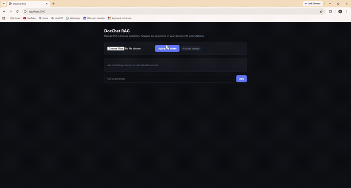
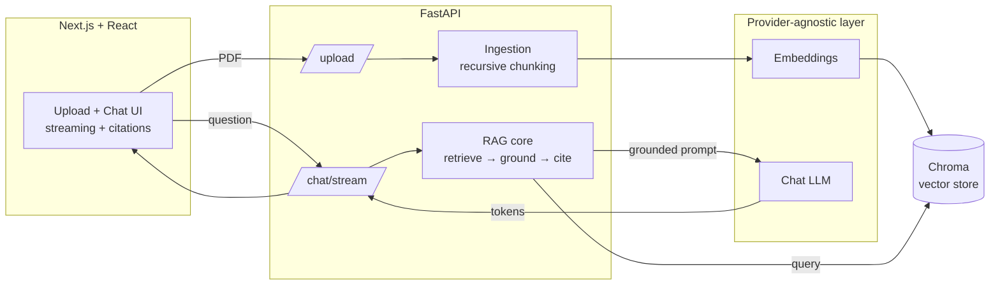

# DocChat RAG — Grounded Document Q&A with Citations

[](https://github.com/nagamsaikiran/rag-document-chat/actions/workflows/ci.yml)

A production-shaped Retrieval-Augmented Generation (RAG) application: upload
documents (PDF, DOCX, TXT, MD, HTML), ask questions — including follow-ups —
and get answers that are **grounded in your documents**, **cited back to the
exact source and page**, and **streamed token-by-token**. Ships with **hybrid
retrieval (vector + BM25)**, **conversation memory with query rewriting**, a
**provider-agnostic LLM layer**, a **hallucination guardrail**, and an
**evaluation harness** that measures retrieval and answer quality with numbers.

> Built to demonstrate full-stack AI engineering: a Python/FastAPI AI backend
> behind a React/Next.js frontend, with the design tradeoffs documented rather
> than hidden.

---

## Demo



*Upload a PDF → ask questions → answers stream in with inline citations → out-of-scope
questions are refused instead of answered.* &nbsp; [▶ Watch full-quality video](docs/demo.mp4)

---

## Architecture


```mermaid
flowchart LR
    subgraph Frontend["Next.js + React"]
        UI[Upload + Chat UI<br/>streaming + citations]
    end

    subgraph Backend["FastAPI"]
        UP[/upload/]
        CH[/chat/stream/]
        ING[Ingestion<br/>recursive chunking]
        RAG[RAG core<br/>retrieve → ground → cite]
    end

    subgraph Providers["Provider-agnostic layer"]
        EMB[Embeddings]
        LLM[Chat LLM]
    end

    VDB[(Chroma<br/>vector store)]

    UI -->|PDF| UP --> ING --> EMB --> VDB
    UI -->|question| CH --> RAG
    RAG -->|query| VDB
    RAG -->|grounded prompt| LLM -->|tokens| CH --> UI
```

**Flow:** PDFs are chunked → embedded → stored in Chroma. A question is embedded,
the nearest chunks are retrieved, and — *only if a chunk clears the relevance
threshold* — a grounded prompt with numbered context is sent to the LLM, which
answers with inline `[1]`/`[2]` citations streamed back to the UI.

---

## Why this isn't a tutorial clone

These are the parts most demos skip — and the parts interviewers probe:

| Decision | What I did | Why |
|---|---|---|
| **Provider abstraction** | LLM + embeddings sit behind ABCs (`app/llm/base.py`); **OpenAI and Google Gemini** both implemented, selectable via one env var. | Swap providers by adding one file — no change to RAG, API, or tests. Gemini's free tier means it runs at $0. |
| **Hybrid retrieval** | Dense vector search fused with BM25 keyword scores via Reciprocal Rank Fusion. | Dense-only retrieval misses exact-match queries (IDs, names, part numbers); BM25 catches them. Gemini embeddings also use retrieval task types (`RETRIEVAL_DOCUMENT`/`RETRIEVAL_QUERY`). |
| **Conversation memory** | Follow-up questions are rewritten into standalone queries (LLM condense step) before retrieval. | "What about section 3?" retrieves nothing on its own — multi-turn is where naive RAG demos fall over. |
| **Honest citations** | After generation, only the `[n]` markers actually used in the answer are returned as citations. | Returning every retrieved chunk as a "citation" overstates evidence. |
| **Multimodal ingestion** | Pages rendered with PyMuPDF and read by a vision model into Markdown — tables, charts, figures, and scanned text. | Plain text extraction misses everything that isn't a text layer. Vision captures the whole page. |
| **Grounding guardrail** | If the best chunk's distance exceeds a threshold, the system refuses instead of answering. | Stops the classic RAG failure: answering from the model's memory when the docs don't contain the answer. |
| **Citations** | Numbered context; the model must cite; the API returns source + page + snippet. | Every claim is auditable — the difference between a toy and something trustworthy. |
| **Evaluation** | Harness scores retrieval hit-rate, answer correctness, and faithfulness (LLM-as-judge), incl. negative tests. | You can't improve what you don't measure — the strongest seniority signal in the repo. |
| **Security** | Streamed uploads with pre-buffer size checks, session validation + TTL expiry, rate limiting, quota caps, prompt-injection hardening, non-root container, generic errors with request ids, `pip-audit` (0 CVEs). | Shows production awareness. See [SECURITY.md](SECURITY.md) and [docs/AUDIT-2026-07-09.md](docs/AUDIT-2026-07-09.md). |

---

## Tech stack

- **Backend:** Python, FastAPI, Pydantic, pypdf, PyMuPDF, python-docx, ChromaDB
- **Retrieval:** hybrid — Chroma dense vectors (cosine) + BM25 (`rank-bm25`) fused with RRF
- **LLM/Embeddings:** OpenAI (`gpt-4o-mini`) or Google Gemini (`gemini-2.5-flash`, free tier) behind a swappable interface; Gemini embeddings use retrieval task types
- **Multimodal:** vision model reads tables, charts, figures, and scanned pages (PyMuPDF render → vision transcription)
- **Frontend:** Next.js (App Router), React, TypeScript
- **Security:** dependency audit (pip-audit, 0 CVEs), streamed uploads + size/page/quota caps, session TTL, rate limiting, hardened prompts, non-root container — see [SECURITY.md](SECURITY.md)

---

## Quickstart

### Easiest path (Windows, one click)

Three helper scripts in the project root automate the whole setup. Run them in order:

| Script | What it does |
|---|---|
| **`1-setup.bat`** | Checks Python/Node, creates the backend virtual environment, installs all dependencies, and creates your `.env` files. Run once. |
| **`2-start-backend.bat`** | Starts the FastAPI backend on `http://localhost:8000`. Leave the window open. |
| **`3-start-frontend.bat`** | Starts the Next.js frontend on `http://localhost:3000`. Leave the window open. |

After `1-setup.bat`, open `backend\.env`, paste your free **`GEMINI_API_KEY`** (get one at
[aistudio.google.com/apikey](https://aistudio.google.com/apikey)) into the `GEMINI_API_KEY=` line,
save, then run scripts 2 and 3 and open **http://localhost:3000**.

> The app defaults to **Google Gemini's free tier**, so it runs at $0. To use OpenAI instead,
> set `LLM_PROVIDER=openai` and `EMBEDDING_PROVIDER=openai` in `.env` and add `OPENAI_API_KEY`.

### Manual path (any OS)

#### 1. Backend
```bash
cd backend
python -m venv .venv && source .venv/bin/activate   # Windows: .venv\Scripts\activate
pip install -r requirements.txt
cp .env.example .env        # defaults to Gemini (free) — add your GEMINI_API_KEY
uvicorn app.main:app --reload --port 8000
```

### 2. Frontend
```bash
cd frontend
npm install
cp .env.local.example .env.local
npm run dev                 # http://localhost:3000
```

#### 3. Use it
Upload a PDF in the UI, then ask questions. Or via API:
```bash
curl -F "files=@yourdoc.pdf" http://localhost:8000/upload
curl -X POST http://localhost:8000/chat -H "Content-Type: application/json" \
     -d '{"question":"What is the refund window?"}'
```

---

## Try it with a sample document

No PDF handy? Use the classic **"Attention Is All You Need"** paper (the Transformer paper) —
it's public, text-based, and fact-dense, which makes citations and the guardrail easy to show:

- Download: **https://arxiv.org/pdf/1706.03762**

Upload it, then ask these questions. The first four are answerable from the paper (you'll get
cited answers); the last one is **not** in the paper, so the app should refuse instead of
guessing — that's the grounding guardrail in action:

| Question | Expected |
|---|---|
| What is the name of the architecture proposed in this paper? | The Transformer |
| How many layers are in the encoder and decoder stacks? | 6 each (N = 6) |
| How many attention heads does the model use? | 8 |
| What BLEU score did the model achieve on English-to-German translation? | 28.4 |
| *What is the capital of Canada?* | **Refuses** — not covered by the document |


---

## Configuration & tuning

All knobs live in `backend/.env` (typed in `app/config.py`): chunk size/overlap,
`TOP_K`, `HYBRID_SEARCH`, and `RELEVANCE_DISTANCE_THRESHOLD` (the guardrail
sensitivity). Distances are **not comparable across embedding models**, so when
the threshold is unset a per-provider default applies (openai 0.55, gemini
0.60). Use the eval harness to sweep these and pick values that maximize
retrieval hit-rate without letting the guardrail leak:

```bash
cd backend
python -m eval.run_eval --questions eval/questions.ci.json --ingest eval/fixtures
```

The same eval runs in CI on every push (add a `GEMINI_API_KEY` repo secret to
enable it), so retrieval quality regressions show up in the badge, not in prod.

---

## Testing

Every push runs four CI jobs: backend tests, frontend tests, a dependency
audit, and the live RAG eval.

**Backend — pytest (36 tests, no network needed):**

```bash
cd backend
pip install -r requirements.txt -r requirements-dev.txt
pytest
```

Covers chunking (recursive split, header/footer stripping, page limits), the
multi-format loaders, vector-store session isolation + per-source delete + TTL
expiry + hybrid keyword retrieval, the RAG core (grounding guardrail, citation
filtering, history clipping, query-rewrite fallback, injection hardening), and
the API security guards (session validation, upload caps, body-size limits,
security headers) via FastAPI's TestClient.

**Frontend — Vitest + Testing Library (7 tests, mocked network):**

```bash
cd frontend
npm install
npm test
```

Covers upload validation, SSE stream parsing (including malformed events),
citation rendering, per-source delete, the session-id contract with the
backend, and that conversation history is sent with follow-ups.

**End-to-end quality — the eval harness** (above) exercises the real pipeline
with live LLM calls against a fixture corpus.

---

## Limitations & what I'd do next

Being explicit about tradeoffs is part of the point:

- **No auth** — sessions isolate visitors (validated ids, TTL expiry) but aren't credentials. Prod would add real authentication and per-user namespaces (see [SECURITY.md](SECURITY.md)).
- **Prompt injection is mitigated, not solved** — context is delimited and declared untrusted, but no prompt-level defense is complete against a crafted document.
- **LLM-as-judge is approximate** — good for relative comparison, not ground truth; a human-labeled set would be stronger.
- **BM25 is per-session, in-process** — perfect at visitor scale; a large shared corpus would want a real sparse index (e.g. Elasticsearch) and a cross-encoder reranker after fusion.
- **Synchronous ingestion** — vision mode on large PDFs can hit host request timeouts; a background job queue with progress events is the production shape.
- **Agentic upgrade** — let the model decide *when* to retrieve and add a second tool (web search) to make this an agentic RAG system.

---

## Project layout

```
backend/
  app/
    config.py            # typed settings from .env
    main.py              # FastAPI: /upload /chat /chat/stream /sources /health
    ingestion.py         # PDF/DOCX/TXT/MD/HTML load + recursive chunking
    vectorstore.py       # Chroma wrapper + hybrid retrieval (BM25 + RRF)
    rag.py               # rewrite → retrieve → ground → cite → (stream)
    llm/
      base.py            # provider-agnostic ABCs
      openai_provider.py # OpenAI implementation
      gemini_provider.py # Gemini implementation (retrieval task types)
      factory.py         # config → concrete provider
  eval/
    run_eval.py          # retrieval / correctness / faithfulness metrics
    questions.example.json
    fixtures/            # synthetic corpus for the CI eval
frontend/
  app/
    page.tsx             # upload + streaming chat + citations
    layout.tsx, globals.css
Dockerfile               # single-container build (UI + API, one URL)
render.yaml              # one-click Render Blueprint
```

---

## Deployment

The app ships as a **single container** — the Next.js UI is built to static files
and served by FastAPI, so the whole thing runs as one service on one URL (ideal
for a custom subdomain). Vision is **off by default** in production to protect
free-tier quota; users opt in per upload via the "Read tables & images" toggle.
A per-IP rate limit guards the public endpoints.

**Deploy to Render (free):**

1. Push the repo to GitHub.
2. Render → **New + → Blueprint** → select the repo (it reads `render.yaml`).
3. Set **`GEMINI_API_KEY`** in the dashboard (and optionally `NEXT_PUBLIC_GA_ID`
   as a build-time var for analytics). Deploy.
4. You get a free URL like `docchat.onrender.com`.

**Custom subdomain (Cloudflare):** in Render add `docchat.yourdomain.com` under
Custom Domains, then add a matching `CNAME` in Cloudflare DNS pointing to the
Render target. HTTPS is automatic.

> Note: the free tier sleeps when idle and uses an ephemeral disk, so the Chroma
> index resets on restart — fine for a demo. Add a persistent disk for durability.

## Analytics

Google Analytics 4 is built in. Set **`NEXT_PUBLIC_GA_ID`** (`G-XXXXXXXX`) to
enable it; it stays off when unset (local dev). Beyond page views, the app emits
custom events — `pdf_uploaded`, `question_asked`, `pdf_upload_failed` — so you can
see real product usage.

---
